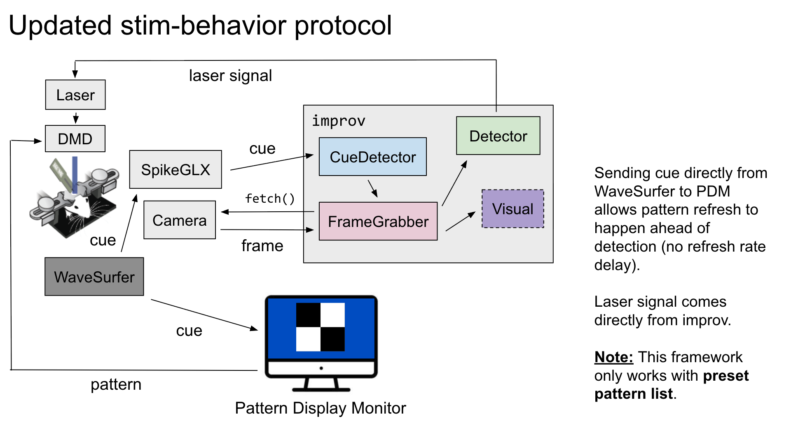

# Automated "lift" detection to prompt stimulation delivery

## Actors

1. `CueDetector`
- Will connect to SpikeGLX and poll for cue signal off of additional channel 
- When cue is detected, signal to `FrameGrabber` actor that it needs to start fetching frames
2. `FrameGrabber`
- Will communicate with the camera and grab frames
  - For lift: start fetching frames and pass to `Detector` only for frames 600-850 
  - For grab: fetch frames from 600-1000
- Pass frames to detector
2. `Detector` 
- Responsible for doing the OpenCV calls for detection 
- Process a frame one at a time, detect paw in ROI 
- If paw has crossed threshold for lift, trigger stim 
  - Only need to trigger stim on first detection of threshold crossing (keep a boolean flag per trial of whether stim has been delivered or not)
- Need to track in a given trial if stim has been triggered or not, only want the first threshold crossing
3. `LaserTrigger`
- use `niqadmx` to actually trigger the laser 
4. `Visual` (Optional) 
- Could have `fastplotlib` running in real-time and showing the detection as it happens

### Notes 
1. Script for determining initial crop
- Run outside of `improv`, connect to the camera and fetch a frame; allow setting crop using `fastplotlib` with simple GUI (output the selected crop)
  - Update the crop in `improv` for the `Detector` actor